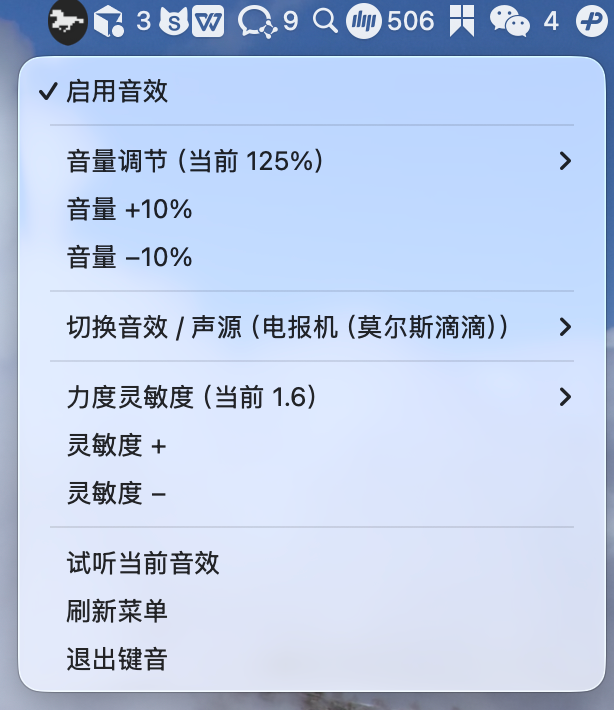

<p align="center">
  
</p>

<h1 align="center">mcl-kboard</h1>

<p align="center">
  <a href="README.en.md">English</a> ·
  简体中文 ·
  <a href="README.ja.md">日本語</a> ·
  <a href="README.ko.md">한국어</a> ·
  <a href="README.fr.md">Français</a> ·
  <a href="README.de.md">Deutsch</a>
</p>

<p align="center">
  利用 Apple Silicon MacBook 内置运动传感器，为静音本机键盘补上机械键盘音效，并让敲击声随力度轻重变化。
</p>

<p align="center">
  <a href="https://github.com/xiehongfei/mcl-kboard">GitHub</a> ·
  <a href="https://gitee.com/hongfeieleven/mcl-kboard">Gitee</a>
</p>

<p align="center">
  
  
  
  
  
</p>

<p align="center">
  
</p>

> [!WARNING]
> 实验性项目。依赖 macOS 未公开的传感器接口，系统升级可能导致失效。真实力度需要兼容的 Apple Silicon MacBook。

## 两种使用方式

| | 日常使用 | 开发 / 调试 |
|--|----------|-------------|
| 目的 | 每天打字有真实力度音效 | 验证按键、音频、菜单栏 |
| 是否需要 sudo | 仅首次安装一次 | 不需要 |
| 力度来源 | 机身真实加速度计 | `imu --mock` 模拟（非真实力度） |
| 日常命令 | `start` / `stop` | 双终端 + mock |

大多数用户只需看 **[日常使用](#日常使用)**。

---

## 日常使用

### 一、首次安装（只需一次）

```bash
# GitHub
git clone https://github.com/xiehongfei/mcl-kboard.git
# 或 Gitee
# git clone https://gitee.com/hongfeieleven/mcl-kboard.git

cd mcl-kboard
python3 -m venv .venv
source .venv/bin/activate
pip install -e .
bash packaging/install.sh     # 会提示输入管理员密码
mcl-kboard doctor --reveal    # 按提示开启「辅助功能」
```

`install.sh` 会：

- 安装到 `/usr/local/mcl-kboard`
- 创建 `/usr/local/bin/mcl-kboard`
- 启动后台 IMU 守护进程（开机自启）

> 不要写 `sudo mcl-kboard install`（sudo 会清掉 PATH）。正确写法见上，或：
> `sudo "$(pwd)/.venv/bin/mcl-kboard" install`

**辅助功能**（必做，否则完全无声）：

1. 系统设置 → 隐私与安全性 → 辅助功能
2. 添加 `doctor` 打印的 Python.app，并打开开关
3. 建议同时授权「终端」或你实际使用的 IDE

### 二、每天这样用

安装完成后，新开终端即可（不必再进仓库目录）：

```bash
mcl-kboard start --menubar    # 开
mcl-kboard stop               # 关
mcl-kboard status             # 看状态
```

屏幕右上角会出现**奔马图标**，点击后可：

- 启用 / 关闭音效
- 调节音量
- 切换音效 / 声源（切换后自动试听三声）
- 调节力度灵敏度
- 试听、退出

也可不用菜单栏，只用命令：

```bash
mcl-kboard volume 80
mcl-kboard style cherry-mx-blue
mcl-kboard style typewriter
```

### 三、卸载

```bash
mcl-kboard stop --full
sudo /usr/local/bin/mcl-kboard uninstall
```

用户配置默认保留在 `~/Library/Application Support/mcl-kboard/`，需要时可手动删除。

---

## 开发 / 调试

用于改代码、测音频链路。**不产生真实力度**，无需 sudo。

```bash
cd mcl-kboard
python3 -m venv .venv
source .venv/bin/activate
pip install -e ".[dev]"
```

开两个终端：

```bash
# 终端 A：模拟加速度计
mcl-kboard imu --mock

# 终端 B：播音 + 菜单栏
mcl-kboard start --menubar --test-sound
```

跑测试：

```bash
pytest
```

可选工具：

```bash
python scripts/fetch_real_packs.py     # 重新拉取第三方音色
python scripts/generate_telegraph.py   # 重新生成电报机音色
python scripts/generate_menubar_icon.py
```

---

## 内置音色

| id | 说明 |
|----|------|
| `cherry-mx-blue` | Cherry MX 青轴（Clicky） |
| `turquoise` | Kailh Box 青绿（Clicky） |
| `nk-cream` | NovelKeys 奶油轴（Linear） |
| `holy-panda` | Holy Panda（Tactile） |
| `ibm-model-m` | IBM Model M 折叠弹簧 |
| `typewriter` | 莫尔斯电报「滴滴滴」（非打字机敲击） |

来源与许可见 [`packs/THIRD-PARTY-LICENSES.md`](packs/THIRD-PARTY-LICENSES.md)。

自定义音色格式见 [`packs/README.md`](packs/README.md)。

---

## 兼容性

需要：Apple Silicon MacBook（通常 M2+）、macOS、Python 3.9+、辅助功能权限。

不适用：Intel Mac、无对应传感器的桌面机、以外接键盘为主的场景。

传感器访问依赖 [`macimu`](https://github.com/olvvier/apple-silicon-accelerometer)。

检查硬件：

```bash
ioreg -l -w0 | grep -A5 AppleSPUHIDDevice
```

---

## 工作原理

```text
机身 IMU（约 200 Hz）
        │
        ▼
  IMU 守护进程（root / mock）
        │  Unix socket 发布冲击幅值
        ▼
  用户态 agent（辅助功能监听按键）
        │  对齐力度 → soft/mid/hard + 音量
        ▼
     本地扬声器
```

---

## 常用命令速查

**日常**

| 命令 | 作用 |
|------|------|
| `mcl-kboard start --menubar` | 启动键音 + 菜单栏 |
| `mcl-kboard stop` | 停止键音 |
| `mcl-kboard status` | 查看状态 |
| `mcl-kboard volume 80` | 音量 80%（也支持 `+` / `-`） |
| `mcl-kboard style <名>` | 切换音色 |
| `mcl-kboard doctor` | 诊断权限 / 传感器 |

**开发**

| 命令 | 作用 |
|------|------|
| `mcl-kboard imu --mock` | 模拟 IMU |
| `mcl-kboard start --foreground` | 前台跑 agent（看日志） |
| `mcl-kboard stop --full` | 停键音 + 停 IMU / 菜单栏 |

完整参数：`mcl-kboard <命令> --help`。

---

## 故障排查

| 现象 | 处理 |
|------|------|
| 测试音有声，打字无声 | `mcl-kboard doctor --reveal`，授权后 `stop` 再 `start --menubar` |
| 有声但轻重无差别 | 别用 mock 测真实力度；确认 `status` 里 `imu daemon: loaded` |
| 菜单栏没有奔马 | 多为 `/usr/local` 仍是旧包：在仓库执行 `bash packaging/install.sh` 更新后再 `mcl-kboard menubar`；或临时 `source .venv/bin/activate && mcl-kboard menubar`。日志：`~/Library/Application Support/mcl-kboard/menubar.log` |
| `sudo: mcl-kboard: command not found` | 用 `bash packaging/install.sh` |

---

## 隐私

按键、力度、音频均在本机处理，无遥测、无云端。日志在 `~/Library/Application Support/mcl-kboard/`。

---

## 项目结构

```text
src/mcl_kboard/   主程序
packs/            音色与第三方许可
packaging/        正式安装脚本
docs/images/      文档截图
scripts/          音色 / 图标生成
tests/            单元测试
```

---

## 已知限制

- 依赖未公开的 IOKit HID 接口
- 力度来自机身振动估算，不是键帽压力传感器
- 尚无签名 `.app` / 图形安装器

---

## 许可证

代码：[MIT License](LICENSE)。

`packs/` 含第三方音频；IBM Model M 采样来自 [`bucklespring`](https://github.com/zevv/bucklespring)（GPL-2.0）。详见 [`packs/THIRD-PARTY-LICENSES.md`](packs/THIRD-PARTY-LICENSES.md)。
